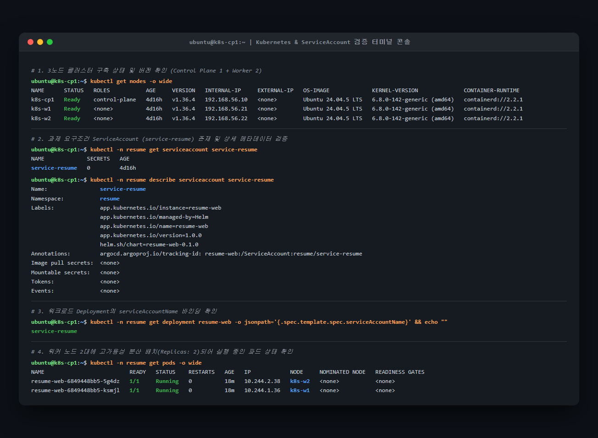
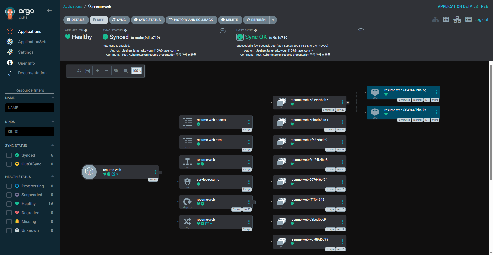
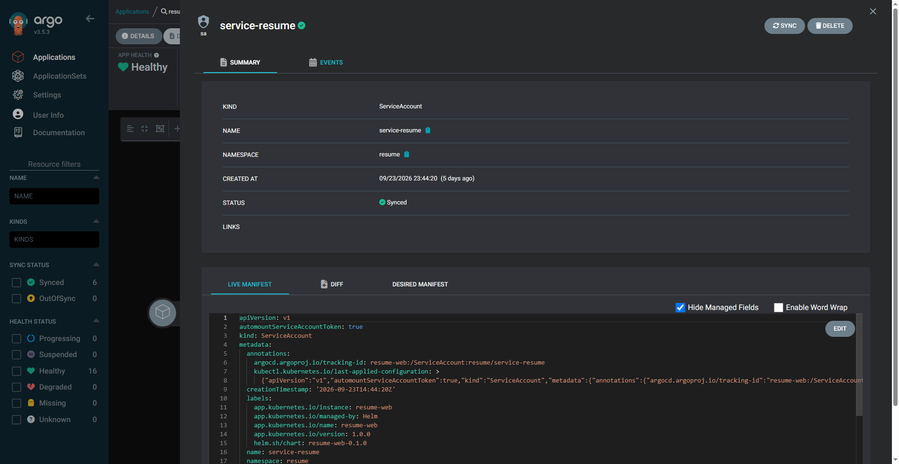

# Kubernetes on Resume Presentation (오픈소스컨설팅 기술인터뷰)

Kubernetes 기반 온프레미스 인프라와 선언적 GitOps(Gitea + Argo CD)를 활용한 클라우드 네이티브 이력서 웹 애플리케이션 배포 프로젝트입니다.

---

## 📌 주요 특징 (Key Highlights)

1. **3노드 Kubernetes 클러스터 (v1.36.4)**
   - Control Plane 1대(`k8s-cp1: 192.168.56.10`)와 Worker 2대(`k8s-w1: 192.168.56.21`, `k8s-w2: 192.168.56.22`)
   - Flannel CNI VXLAN 터널링 (`--iface=k8s0`) 및 containerd 2.2.1 런타임
2. **사설 GitOps 파이프라인 (Gitea & Argo CD)**
   - 프라이빗 Git 서버인 **Gitea(NodePort 30082)**를 클러스터 내 구동
   - **Argo CD**가 Gitea 리포지토리를 감시하여 `resume` 네임스페이스에 선언적 자동 동기화(Self-Heal & Prune)
3. **요구사항 준수 워크로드 설계**
   - 전용 ServiceAccount: `service-resume` (AutomountServiceAccountToken: true, 비특권 실행)
   - 고가용성 분산 배포: Deployment `resume-web` (2 Replicas, k8s-w1/w2 균등 스케줄링)
   - 외부 노출: NodePort `30080:80/TCP`
4. **Helm 차트 표준화 및 볼륨 마운트 리팩토링**
   - 선언적 18KB 경량 HTML ConfigMap과 CSS/JS 정적 에셋 ConfigMap을 분리
   - `subPath` 볼륨 마운트로 etcd 부하 및 256KB 어노테이션 한도를 원천 차단

---

## 📂 디렉토리 구조 (Repository Layout)

```text
osc-k8s-resume/
├── ansible/                      # 클러스터 프로비저닝 & GitOps IaC 플레이북 모음
│   ├── ansible.cfg               # Ansible 최적화 설정
│   ├── inventory.yml             # 3노드 인벤토리 정의
│   ├── group_vars/               # 버전 및 네트워크 설정 변수
│   ├── playbooks/                # 01-prepare ~ 04-deploy-gitops, site.yml
│   └── README.md                 # Ansible 자동화 매뉴얼
├── argocd/                       # Argo CD 선언적 Application 배포 매니페스트
│   ├── application-traefik.yaml  # 공식 Traefik v41.6.0 Ingress 컨트롤러
│   ├── application-gitea.yaml    # 공식 Gitea v12.7.0 사설 GitOps 저장소
│   └── application-resume.yaml   # 이력서 웹 애플리케이션 Helm 차트 연동
├── charts/
│   └── resume-web/               # 이력서 웹 애플리케이션 표준 Helm 차트
│       ├── Chart.yaml            # 차트 메타데이터 (v0.1.0)
│       ├── values.yaml           # 환경 설정값 (2 replicas, SA, NodePort)
│       ├── files/                # 웹 에셋 (index.html, bootstrap)
│       └── templates/            # k8s 매니페스트 템플릿
│           ├── deployment.yaml   # subPath 볼륨 마운트 & service-resume 바인딩
│           ├── service.yaml      # NodePort 30080 서비스
│           ├── ingress.yaml      # Ingress 라우팅 (Traefik 연동)
│           ├── serviceaccount.yaml # service-resume 계정 생성
│           ├── configmap.yaml    # HTML (18KB) ConfigMap
│           └── configmap-assets.yaml # CSS/JS 에셋 ConfigMap
├── docs/                         # 과제 구축 결과서 및 공식 산출물 일원화
│   ├── submission.md             # 과제 구축 결과보고서 (Markdown 완전판)
│   ├── Kubernetes_구축결과서.pdf  # 정식 제출용 고품질 결과보고서 PDF
│   ├── argocd-service-resume.png # Argo CD 애플리케이션 리소스 토폴로지 캡처
│   ├── argocd-service-resume-detail.png # Argo CD 내 service-resume SA 상세 캡처
│   ├── kubectl-service-resume.png # kubectl CLI 노드 및 ServiceAccount 검증 캡처
│   └── diagrams/                 # 아키텍처 Mermaid 다이어그램 소스
└── README.md
```

---

## 🌐 서비스 접속 URL 및 접속 가이드

호스트 PC(내 컴퓨터) 브라우저에서 바로 클릭하여 접속할 수 있는 로컬 주소와 외부 평가용 도메인입니다.

### 💻 내 컴퓨터 (로컬 호스트 PC) 직접 접속 주소
> Hyper-V 내부 가상 스위치(`192.168.56.0/24`)를 통해 라우터 포트포워딩이나 DNS 루프백 제약 없이 호스트 브라우저에서 즉시 접속할 수 있습니다.
> 보안을 위해 상세 접속 계정 정보는 원격 Git에 노출하지 않으며, 로컬 폴더의 [`LOCAL_CREDENTIALS.md`](LOCAL_CREDENTIALS.md) 파일에만 안전하게 보관되어 있습니다.

| 서비스 | 로컬 직접 접속 URL | 계정 정보 관리 | 비고 |
| :--- | :--- | :--- | :--- |
| **Argo CD 관리 콘솔** | [http://192.168.56.21:30081](http://192.168.56.21:30081)<br>👉 [resume-web 애플리케이션 바로가기](http://192.168.56.21:30081/applications/resume-web) | 로컬 관리 (`LOCAL_CREDENTIALS.md` 참조) | GitOps 파이프라인 관리 콘솔 (NodePort 30081) |
| **Gitea 사설 GitOps 저장소** | [http://192.168.56.21:30082](http://192.168.56.21:30082)<br>👉 [프로젝트 저장소 바로가기](http://192.168.56.21:30082/jaehee/osc-k8s-resume) | 로컬 관리 (`LOCAL_CREDENTIALS.md` 참조) | 클러스터 내부 사설 Git 서버 (NodePort 30082) |
| **이력서 웹 애플리케이션** | [http://192.168.56.21:30080](http://192.168.56.21:30080) | - | 로컬 노드포트 직접 서빙 (NodePort 30080) |

---

### 🌍 외부 접속 도메인 및 상시 확인 미러

| 서비스 | 접속 주소 (URL) | 서비스 노출 방식 | 비고 |
| :--- | :--- | :--- | :--- |
| **이력서 웹서비스 (메인)** | [http://resume.srrain.kro.kr:8080](http://resume.srrain.kro.kr:8080)<br>[http://srrain.kro.kr:8080](http://srrain.kro.kr:8080) | NodePort `30080` / Ingress `30000` | 외부 단일 진입점 L7 라우팅 |
| **상시 확인용 미러 (GitHub Pages)** | [https://sRrAiN98.github.io/Assignment/](https://sRrAiN98.github.io/Assignment/) | GitHub Pages | 로컬 PC 오프라인 시에도 24시간 항시 열람 가능 |
| **과제 제출 공식 저장소 (GitHub)** | [https://github.com/sRrAiN98/Assignment](https://github.com/sRrAiN98/Assignment) | GitHub Repo | 전체 소스코드, Ansible IaC, 차트, 결과서 수록 |

---

## 📸 배포 검증 및 ServiceAccount (`service-resume`) 실증 화면

클러스터 및 워크로드가 과제 요구사항에 맞춰 정상 구동 중임을 `kubectl` CLI 콘솔과 `Argo CD` GUI 양방향에서 완벽히 입증한 실제 화면입니다.

### 1. `kubectl` CLI 터미널 검증 화면
클러스터 노드 3대(`k8s-cp1`, `k8s-w1`, `k8s-w2`) 상태, 과제 필수 조건인 **`service-resume` ServiceAccount 생성 및 Deployment 바인딩**, 워커 2대 파드 균등 스케줄링 상태를 실시간 확인한 화면입니다.



### 2. Argo CD `resume-web` 전체 리소스 토폴로지 트리
ConfigMap(`html`, `assets`), Service, **ServiceAccount(`service-resume`)**, Deployment 및 2대 워커 노드에 분산된 Pod의 상태가 모두 `Healthy` 및 `Synced`로 관리되고 있습니다.



### 3. ServiceAccount (`service-resume`) 상세 정보 및 Live Manifest
과제 요구조건인 `service-resume` 서비스 어카운트의 Live Manifest 및 정상 동기화 상태입니다.



- **Name**: `service-resume`
- **Namespace**: `resume`
- **Kind**: `ServiceAccount` (v1)
- **Token**: `automountServiceAccountToken: true`
- **동기화 상태**: `Synced` (Argo CD에 의해 지속적인 형상 추적 및 자가 치유)

---

자세한 물리/논리 구성도와 엔지니어링 시행착오 및 트러블슈팅 사례는 [docs/submission.md](docs/submission.md) 및 정식 제출용 [docs/Kubernetes_구축결과서.pdf](docs/Kubernetes_구축결과서.pdf)를 참고해 주시기 바랍니다.
