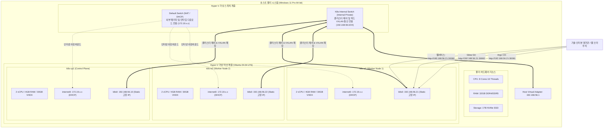
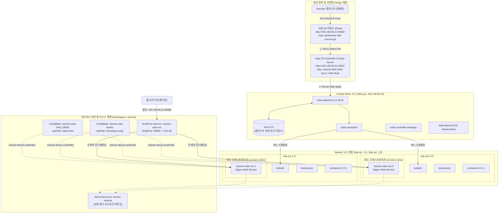

# Kubernetes on Resume Presentation - 시스템 아키텍처 명세서

본 문서는 오픈소스컨설팅(OSC) Kubernetes 기술 인터뷰 과제 요건에 따라 구축된 시스템의 **물리 구성도(Physical Topology)**와 **논리 구성도(Logical Topology)**를 상세히 기술합니다.

---

## 1. Kubernetes 물리 구성 (Physical Topology)

> **[과제 요건] 자신이 구축한 시스템의 물리 구성도를 기술하시오.**

### 1.1 물리/가상 인프라 토폴로지 다이어그램

### 1.2 물리 및 가상 인프라 상세 제원표

| 구분 | 호스트 / 노드명 | 역할 | 할당 사양 (vCPU / RAM / Disk) | 네트워크 구성 (IP / MAC) | 비고 |
| :--- | :--- | :--- | :--- | :--- | :--- |
| **물리 호스트** | Local Workstation | Hyper-V 호스트 | 8C 16T / 32GB RAM / 1TB NVMe | Windows 11 Pro, Host IP: `192.168.56.1` | 가상 스위치 관리 및 라우팅 |
| **VM 1** | **k8s-cp1** | Control Plane | 2 vCPU / 4GB RAM / 30GB SSD | • `internet0`: 172.19.x.x (DHCP) • `k8s0`: `192.168.56.10` (`00:15:5d:56:00:10`) | etcd, API Server, Scheduler |
| **VM 2** | **k8s-w1** | Worker Node 1 | 2 vCPU / 4GB RAM / 30GB SSD | • `internet0`: 172.19.x.x (DHCP) • `k8s0`: `192.168.56.21` (`00:15:5d:56:00:21`) | 워크로드 Pod 분산 배치 |
| **VM 3** | **k8s-w2** | Worker Node 2 | 2 vCPU / 4GB RAM / 30GB SSD | • `internet0`: 172.19.x.x (DHCP) • `k8s0`: `192.168.56.22` (`00:15:5d:56:00:22`) | 워크로드 Pod 분산 배치 |

### 1.3 물리 네트워크 격리 및 이중화 원리
- **격리된 전용 스위치 (`K8s-Internal`)**: 호스트 머신의 무선랜(Wi-Fi) 접속 환경 변경이나 IP 변동에 구애받지 않고, 노드 간 통신, kube-apiserver 접근, etcd 클러스터링 및 Flannel CNI 오버레이 통신이 영구적으로 보장됩니다.
- **아웃바운드 전용 스위치 (`Default Switch`)**: OS 패키지, containerd 바이너리, Kubernetes 이미지 다운로드를 위해서만 사용되며, 클러스터 내부로는 인바운드 트래픽이 유입되지 않아 보안이 강화됩니다.

---

## 2. Kubernetes 논리 구성 (Logical Topology)

> **[과제 요건] 자신이 구축한 시스템의 논리 구성도를 기술하시오.**

### 2.1 논리 아키텍처 다이어그램

### 2.2 논리 계층별 컴포넌트 매핑 및 역할

| 계층 | 컴포넌트 | 네임스페이스 / 버전 | 상세 역할 및 구현 내용 |
| :--- | :--- | :--- | :--- |
| **코어 제어 계층** | kube-apiserver, etcd, scheduler | `kube-system` / v1.36.4 | 선언적 상태 제어, 쿼럼 분산 저장 및 스케줄링 |
| **네트워크(CNI)** | Flannel CNI | `kube-flannel` / v0.28.8 | VXLAN 터널링 오버레이 (`10.244.0.0/16`), `--iface=k8s0` 바인딩 |
| **컨테이너 런타임** | containerd | v2.2.1 | `SystemdCgroup=true`, CRI 안정성 및 리소스 격리 |
| **형상 관리(Git)** | Gitea | `gitea` / 1.22 | 사설 Git 저장소 (NodePort `30082`, `jaehee/osc-k8s-resume`) |
| **선언형 GitOps** | Argo CD | `argocd` / v2.13.0 | Git 저장소 자동 추적, Self-Heal & Prune 자동 롤아웃 (NodePort `30081`) |
| **워크로드** | `resume-web` Deployment | `resume` (2 Replicas) | `k8s-w1`, `k8s-w2` 분산 스케줄링, 비특권(Non-root) 실행 |
| **서비스 계정** | **service-resume** | `resume` | **과제 필수 요구조건**: 파드에 연결된 단독 ServiceAccount |
| **설정/볼륨** | ConfigMap 2종 | `resume` | HTML(18KB)과 CSS/JS 에셋을 분리하고 `subPath` 볼륨 마운트 적용 |
| **서비스 노출** | NodePort Service | `resume` | 외부 접근 포트 `30080`을 통해 2개 워커 파드로 HTTP 로드밸런싱 |

---

## 3. 원본 다이어그램 소스 파일 링크

- [물리 구성도 Mermaid 소스](diagrams/physical-topology.mmd)
- [논리 구성도 Mermaid 소스](diagrams/logical-topology.mmd)
- [Helm 패키징 구조 Mermaid 소스](diagrams/helm-architecture.mmd)
