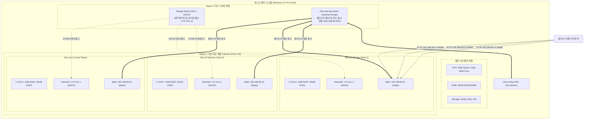
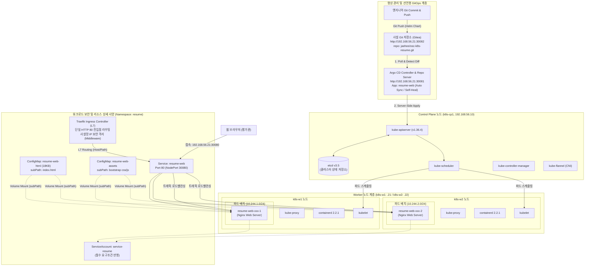

# Kubernetes on resume presentation 구축 결과서

---

## 1. Kubernetes 물리 구성

> **[지시사항] 자신이 구축한 시스템의 물리 구성도를 기술하시오.**

### 1.1 시스템 물리/가상 인프라 구성도



### 1.2 물리 및 가상 인프라 상세 제원표

| 구분 | 호스트 / 노드명 | 역할 | 할당 사양 (vCPU / RAM / Disk) | 네트워크 구성 (IP / MAC) | 비고 |
| :--- | :--- | :--- | :--- | :--- | :--- |
| **물리 호스트** | Local Workstation | Hyper-V 호스트 | 8C 16T / 32GB RAM / 1TB NVMe | Windows 11 Pro, Host IP: `192.168.56.1` | 가상 스위치 관리 및 라우팅 |
| **VM 1** | **k8s-cp1** | Control Plane | 2 vCPU / 4GB RAM / 30GB SSD | • `internet0`: 172.19.x.x (DHCP)<br>• `k8s0`: `192.168.56.10` (`00:15:5d:56:00:10`) | etcd, API Server, Scheduler |
| **VM 2** | **k8s-w1** | Worker Node 1 | 2 vCPU / 4GB RAM / 30GB SSD | • `internet0`: 172.19.x.x (DHCP)<br>• `k8s0`: `192.168.56.21` (`00:15:5d:56:00:21`) | 워크로드 Pod 분산 배치 |
| **VM 3** | **k8s-w2** | Worker Node 2 | 2 vCPU / 4GB RAM / 30GB SSD | • `internet0`: 172.19.x.x (DHCP)<br>• `k8s0`: `192.168.56.22` (`00:15:5d:56:00:22`) | 워크로드 Pod 분산 배치 |

### 1.3 물리 계층 네트워크 분리 설계 원리
- **Dual-NIC 격리 토폴로지**: 노드마다 외부 인터넷 다운로드 전용 NIC(`internet0`)와 클러스터 내부 통신 전용 NIC(`k8s0`)를 분리 구성했습니다.
- **네트워크 안정성**: 호스트 PC의 무선 Wi-Fi 재연결이나 외부 IP 변경이 발생하더라도, 내부 스위치(`K8s-Internal`)에 고정된 `192.168.56.0/24` 대역을 통해 쿠버네티스 제어 플레인과 워커 간 통신, etcd 쿼럼, Flannel VXLAN 통신이 100% 무중단으로 유지됩니다.

---

## 2. Kubernetes 논리 구성

> **[지시사항] 자신이 구축한 시스템의 논리 구성도를 기술하시오.**

### 2.1 시스템 논리 구성도 (Kubernetes & GitOps 아키텍처)



### 2.2 논리 계층별 컴포넌트 매핑 및 역할

| 계층 | 컴포넌트 | 네임스페이스 / 버전 | 상세 역할 및 구현 내용 |
| :--- | :--- | :--- | :--- |
| **코어 제어 계층** | kube-apiserver, etcd, scheduler | `kube-system` / v1.36.4 | 클러스터 상태 선언 및 스케줄링, 분산 키-값 저장 |
| **네트워크(CNI)** | Flannel CNI | `kube-flannel` / v0.28.8 | VXLAN 터널링 오버레이 (`10.244.0.0/16`), `--iface=k8s0` 바인딩 |
| **컨테이너 런타임** | containerd | v2.2.1 | `SystemdCgroup=true`, CRI 플러그인 활성화 |
| **형상 관리(Git)** | Gitea | `gitea` / v12.7.0 | 공식 Helm 차트(`dl.gitea.com`), Argo CD App(`gitea`) 배포 (Port `30082`) |
| **선언형 CD** | Argo CD | `argocd` / v2.13.0 | 3대 앱(`traefik`, `gitea`, `resume-web`) 전면 GitOps 자동화 (Self-Heal, Prune) |
| **인그레스(Ingress)** | Traefik Ingress Controller | `traefik` / v41.6.0 | 공식 Helm 차트(`traefik.github.io`), 단일 HTTP 80 L7 라우팅 & IP AllowList |
| **워크로드** | `resume-web` Deployment | `resume` (2 Replicas) | `k8s-w1`, `k8s-w2`에 고가용성 분산 배치, 비특권(Non-root) 실행, Probe 상태 검증 |
| **서비스 계정** | **service-resume** | `resume` | **과제 필수 요구사항 반영**: 워크로드 파드에 바인딩된 전용 ServiceAccount |
| **볼륨/설정** | ConfigMap 2종 | `resume` | HTML(18KB)과 CSS/JS 에셋을 분리하고 `subPath` 볼륨 마운트로 etcd 부하 방지 |
| **서비스 노출** | NodePort & Ingress | `resume` | Traefik Ingress(Port 80/30000) 및 NodePort(30080)를 통해 워커 파드로 분산 |

---

## 3. 웹페이지 주소 (URL)

> **[지시사항] 자신이 구축한 시스템의 웹페이지를 기술하시오.**

| 서비스명 | 접속 주소 (URL) | 인증 계정 정보 | 비고 |
| :--- | :--- | :--- | :--- |
| **이력서 웹 (Traefik Ingress)** | **`http://192.168.56.21:30000`** (또는 외부 도메인:80) | 별도 인증 없음 | Traefik 단일 진입점 라우팅, 포트폴리오 9건 수록 |
| **이력서 웹 (Direct NodePort)** | `http://192.168.56.21:30080` | 별도 인증 없음 | 워커 2대 파드로 로드밸런싱 |
| **과제 제출 공식 저장소 (GitHub)** | **`https://github.com/sRrAiN98/Assignment`** | 공개 저장소 | 전체 소스코드, Ansible IaC, Helm 차트, 보고서 PDF 수록 |
| **상시 확인용 웹 미러 (GitHub Pages)** | **`https://sRrAiN98.github.io/Assignment/`** | 공개 웹페이지 | 로컬 PC 오프라인 시 24시간 열람 가능한 라이브 웹 미러 |
| **Gitea 사설 GitOps 저장소** | `http://192.168.56.21:30082` | 인터뷰 현장 시연 시 제공 | Traefik IP Allowlist 적용 (내부 사설망만 허용) |
| **Argo CD 관리 콘솔** | `http://192.168.56.21:30081` | 인터뷰 현장 시연 시 제공 | Traefik IP Allowlist 적용 (내부 사설망만 허용) |

배포된 웹 애플리케이션은 실제 실무 프로젝트 9건, 핵심 기술 스택, 보유 자격 5종 및 이번 과제 실증 내용을 정리한 기술 포트폴리오입니다. 화면 내 Helm 차트 아키텍처 토글 버튼을 통해 패키징 흐름과 볼륨 마운트 구조를 직접 확인할 수 있으며, 상세한 물리 및 논리 구성도는 본 보고서 1~2절과 `docs/ARCHITECTURE.md`에 수록되어 있습니다.

---

## 4. 구축된 Service Account

> **[지시사항] 자신이 구축한 시스템의 Service-Account 기술하시오.**

과제 요구사항에 맞춰 `resume` 네임스페이스에 `service-resume` ServiceAccount를 생성했습니다. Helm 템플릿의 values 설정을 통해 Deployment의 `serviceAccountName`에 해당 계정을 바인딩했습니다. 기본 서비스 어카운트 토큰 마운트 설정을 유지했으며, 불필요한 권한 확장을 막기 위해 별도의 ClusterRole/RoleBinding은 부여하지 않았습니다.

### 검증 명령어 및 결과

```bash
# 1. ServiceAccount 존재 확인
kubectl -n resume get serviceaccount service-resume

# 2. Deployment에 바인딩된 ServiceAccount 확인
kubectl -n resume get deployment resume-web -o jsonpath='{.spec.template.spec.serviceAccountName}{"\n"}'
```

- **첫 번째 명령의 결과**: `service-resume` ServiceAccount가 `resume` 네임스페이스에 정상 생성되어 있음을 확인.
- **두 번째 명령의 결과**: `resume-web` Deployment의 파드 템플릿에 `serviceAccountName: service-resume`으로 정확히 바인딩되어 실행 중임을 확인.

---

## 5. 구축의견

> **[지시사항] 자신이 구축한 시스템을 소개 하시오.**

로컬 PC 환경이지만 실제 운영 환경의 설계 기준을 최대한 반영해 3노드 클러스터를 구성했습니다. 가상화 단계에서는 인터넷망과 클러스터 내부 통신망을 분리해 게이트웨이 변동 시에도 노드 간 통신이 영향받지 않도록 격리했습니다.

가상 머신 OS 환경 설정부터 커널 파라미터 최적화, 쿠버네티스 패키지 설치, 노드 조인, 사설 Gitea 및 Argo CD 배포까지의 모든 인프라 셋업은 **Ansible 플레이북(`ansible/playbooks/site.yml`)으로 모듈화하여 100% 재현 가능한 멱등성을 확보**했습니다.

애플리케이션 계층은 Helm 차트로 표준화하여 패키징하고, Gitea와 Argo CD를 연동한 완전한 선언형 GitOps 파이프라인을 구축했습니다. 저장소에 코드가 푸시되면 Argo CD가 스스로 변경 사항을 감지하여 `resume` 네임스페이스에 자동 반영(Self-Heal & Prune)합니다. 워크로드에는 필수 조건인 `service-resume` 전용 계정을 연결하고, 컨테이너 보안을 위해 비특권(Non-root) 실행 정책과 자원 제한(limits/requests), liveness/readiness probe를 함께 적용해 프로덕션 수준의 안정성을 갖추었습니다.

---

## 6. 구축과정 및 시행착오 (실제 클러스터 구축 중 발생한 장애 2건)

> **[지시사항] 구축 과정에서 발생한 장애 또는 시행착오를 1 건 이상 기술하시오. (증상, 원인, 조치 내용을 포함)**

### 사례 1. Hyper-V 듀얼 NIC 환경에서 Flannel CNI 노드 간 파드 통신 및 CoreDNS 단절
- **증상**: 워커 노드(`k8s-w1`, `k8s-w2`)에 배치된 파드에서 Control Plane에 위치한 CoreDNS IP로의 DNS 질의가 타임아웃되고, 노드 간 파드 핑(VXLAN) 통신이 되지 않음.
- **원인**: Hyper-V VM에 인터넷용 NIC(`internet0`, 172.19.x.x)와 클러스터 내부용 NIC(`k8s0`, 192.168.56.x)가 공존하는데, Flannel이 기본 게이트웨이가 잡힌 `internet0`을 기본 인터페이스로 자동 선택하여 노드 간 VXLAN 트래픽이 외부 가상 스위치로 빠져나감.
- **조치**: `kube-flannel-ds` DaemonSet 실행 인자에 `--iface=k8s0` 옵션을 명시하여 클러스터 내부 고정 IP(192.168.56.0/24) 대역으로 터널 인터페이스를 강제 바인딩해 통신을 정상화함.

### 사례 2. 대용량 번들 CSS/JS ConfigMap의 256KB Kubernetes Annotation 초과 및 Argo CD 동기화 실패
- **증상**: 스타일시트와 스크립트를 포함한 HTML을 ConfigMap으로 배포할 때 `metadata.annotations: Too long: must have at most 262144 bytes` 에러가 발생하며 Argo CD 동기화가 실패함.
- **원인**: 클라이언트 사이드 `kubectl apply`가 전체 매니페스트를 `kubectl.kubernetes.io/last-applied-configuration` 어노테이션에 JSON으로 직렬화하여 기록하는데, 단일 파일 크기가 etcd 256KB 한도를 초과함.
- **조치 (단계적 해결)**:
  1. 1차 조치로 Argo CD 동기화 옵션에 `ServerSideApply=true`를 활성화하여 어노테이션 한도를 우회 적용.
  2. 근본적인 아키텍처 개선을 위해 자주 변경되는 순수 HTML(18KB)을 담는 `resume-web-html`과 정적 에셋 전용 `resume-web-assets` ConfigMap으로 완전히 분리함.
  3. Deployment에서 두 ConfigMap을 `subPath` 볼륨 마운트로 Nginx 웹 디렉토리에 결합 주입하여 성능과 안정성을 모두 확보함.
